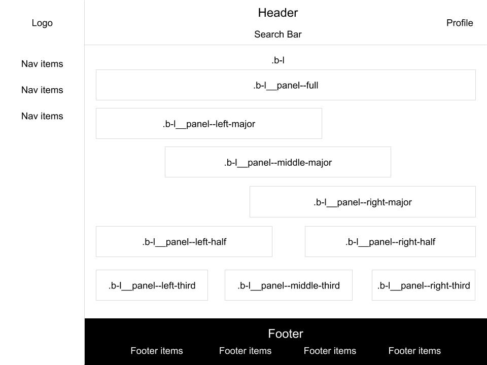

# Factor UI

[](https://travis-ci.com/mozilla-it/factor-ui)

## Project description

This will be a central repository for internally shared templates and components within Mozilla. This README will be the central location for all documentation relating to our internal components.

This project is intended to be a helpful "bootstrapped" kickstarter for all internal applications, providing out of the box internal themes and styles while allowing for flexibility to each individual application.

## Travis CI

### Adding a Secret

```
travis encrypt --add --com KEY=VALUE
```

## Installation

Run the following command in your terminal

```
npm install --save @mozilla/factor-ui
```

## Templates

#### Include

Include this in whichever VueJS component you wish to use the template.

In component import

```
<template>
  <FactorBlockTemplate>
    <div slot="nav" >
      <!-- Nav content -->
    </div>
    <div slot="profile">
      <!-- Profile content -->
    </div>
    <div slot="main">
      <!-- Main content -->
    </div>
    <div slot="footer-links">
      <!-- Links in footer content -->
    </div>
  </FactorBlockTemplate>
</template>

<script>
import { FactorBlockTemplate } from '@mozilla/factor-ui';
import '@mozilla/factor-ui/dist/lib/factor.css';

export default {
  components: {
    FactorBlockTemplate
  },
}
</script>
```

This works the same with each of the different templates: FactorBlockTemplate, FactorFlowTemplate, FactorNavTemplate

#### Api

| Property        | Type   | Description                                 |
| --------------- | ------ | ------------------------------------------- |
| searchBarConfig | Object | Object of configurations for the search bar |

searchBarConfig

```
{
  handler: [Function] // Function for handling input submit
  onKeyUp: [Function] // Function for handling input "keyup" event
  onDropdownClicked: [Function(item)] // Function for handling when dropdown event item clicked
  onClearQuery: [Function] // Function for handling what happens when 'x' is clicked in search box
  label: [String] // String that acts like a placeholder when text is not entered in box
  value: [String] // Value that input starts out with
  dropdownEnabled: [Boolean] // Value to enable dropdown or disable
  suggestions: [Array({label: 'text', ...})] // List of items that would go in the suggestions list.
                                                Label is necessary for this list as it is the display text for the item.
}
```

#### Slots

| Name         | Type         | Area                                          |
| ------------ | ------------ | --------------------------------------------- |
| logo         | HTML Element | Upper left logo                               |
| nav          | HTML Element | Upper right nav area next to the profile area |
| profile      | HTML Element | Upper right profile area                      |
| main         | HTML Element | All content between header and footer         |
| footer-links | HTML Element | List of footer links                          |

### Block template


### Flow template


### Nav Template



## Components

### Include

Include this in whichever VueJS component you wish to use the template.

In component import

```
<template>
  <FactorComponent />
</template>

<script>
import { FactorComponent } from '@mozilla/factor-ui';
import '@mozilla/factor-ui/dist/lib/factor.css';

export default {
  components: {
    FactorComponent
  },
}
</script>
```

### Components

| Name            | Description                                          |
| --------------- | ---------------------------------------------------- |
| FactorFooter    | Footer component for layout                          |
| FactorHeader    | Header component for layout                          |
| FactorIcon      | Component to serve up all icons in templates         |
| FactorPanel     | Component to contain any block contents in templates |
| FactorSearchBar | Component for search bar in header and anywhere else |

### Properties/Slots

#### FactorFooter

Slots:

- Links:

```
<FactorFooter>
  <ul class="footerlinks" slot="links">
    <!-- Insert links -->
  </ul>
</FactorFooter>
```

#### FactorHeader

Properties:

| Name            | Type/Default  | Description                              |
| --------------- | ------------- | ---------------------------------------- |
| hideSearchBar   | Boolean/false | determine whether to show the search bar |
| searchBarConfig | Object/null   | Config object for FactorSearchBar        |
| noLogo          | Boolean/false | Determine whether to hide logo           |

Slots:

- Logo:

```
<FactorHeader>
  
</FactorHeader>
```

- Nav:

```
<FactorHeader>
  <ul class="nav" slot="nav">
    <!-- Insert nav items -->
  </ul>
</FactorHeader>
```

- Profile:

```
<FactorHeader>
  <div class="profile" slot="profile">
    <!-- Insert profile content -->
  </div>
</FactorHeader>
```

#### FactorIcon

Properties:

| Name   | Type/Default | Description                    |
| ------ | ------------ | ------------------------------ |
| id     | String       | Name of icon to use            |
| width  | Number       | The size in width of the icon  |
| height | Number       | The size in height of the icon |

#### FactorPanel

Properties:

| Name         | Type/Default  | Description                                            |
| ------------ | ------------- | ------------------------------------------------------ |
| fullContent  | Boolean/false | Determine whether should have inner padding            |
| fullOnMobile | Boolean/false | Determine whether panel should be full width on mobile |
| title        | String/''     | Title of panel                                         |
| hideContent  | Boolean/false | Determine whether to hide content inside panel         |

Slots:

- Header:

```
<FactorPanel>
  <div class="header" slot="header">
    <!-- Insert header content -->
  </div>
</FactorPanel>
```

- Content:

```
<FactorPanel>
  <div class="content" slot="content">
    <!-- Insert 'content' content -->
  </div>
</FactorPanel>
```

#### FactorSearchBar

Properties:

| Name              | Type/Default | Description                         |
| ----------------- | ------------ | ----------------------------------- |
| searchBarHandler  | Function     | Handler for when input is submitted |
| searchBarLabel    | String/''    | Placeholder text for input          |
| searchBarValue    | String/''    | Initial value for input             |
| searchBarDropdown | Array/\[\]]  | Array of drop down list items       |

Events:

| Name                        | Description                                |
| --------------------------- | ------------------------------------------ |
| keyup                       | Handler for every "keyup" on input         |
| clearQuery                  | Placeholder text for input                 |
| closeSearchBar              | event on submit wihout value               |
| search-bar-dropdown-clicked | Event when item is clicked or 'enter'ed on |

## Styles

### Standards

This project is built in scss inside single file Vue components. The scss portions of the component import styles from /src/shard/styles.
We implement the CSS naming structure: BEM (Block Element Modifier) http://getbem.com/introduction/

The way to think about how naming should be considered with BEM is consider the component block that this class is in, say nav. Then consider which specific element is being addressed, say list item. Then consider if there is some small style modification say horizontal.

In this case, we might build a css name: nav\_\_list-item--horizontal. This is a loose structure. {block}\_\_{element}--{modifier} are all suggested pieces.

- {block}--{modifier}
- {block}\_\_{element}
- {element}--{modifier}

These are all available methods of using the standard.

### Colors

| Name            | code    |
| --------------- | ------- |
| --gray-10       | #f9f9fa |
| --gray-20       | #ededf0 |
| --gray-30       | #d7d7db |
| --gray-40       | #b1b1b3 |
| --gray-50       | #737373 |
| --gray-60       | #4a4a4f |
| --blue-60       | #4a4a4f |
| --green-80      | #006504 |
| --white         | #fff    |
| --black         | #000    |
| --light-red     | #f5d8e1 |
| --neon-red      | #ff0039 |
| --duck-egg-blue | #f2fcfd |
| --charcoal-gray | #38383d |
| --true-green    | #12bc00 |

### Icons

Icon page: [icons/README.md](./src/assets/svg/README.md)
